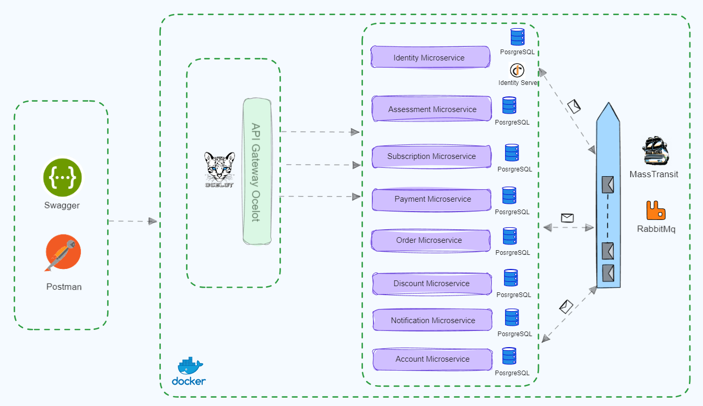

# SuuCat : .NET sample microservices application #

SuuCat is a sample containerized application consisting of several microservices.
Its purpose is to use microservice patterns in practice.

Development is still in progress. 

[Wiki](https://github.com/ebubekirdinc/SuuCat/wiki)  

[Getting Started](https://github.com/ebubekirdinc/SuuCat/wiki/GettingStarted)  

[Saga Orchestration with MassTransit and RabbitMq](https://github.com/ebubekirdinc/SuuCat/wiki/SagaOrchestration)

[API Gateway with Ocelot](https://github.com/ebubekirdinc/SuuCat/wiki/ApiGateway)

[Authorization and Authentications with IdentityServer](https://github.com/ebubekirdinc/SuuCat/wiki/IdentityServer)

[Eventual Consistency with RabbitMq](https://github.com/ebubekirdinc/SuuCat/wiki/EventualConsistency)

[Distributed Logging with ElasticSearch, Kibana and SeriLog](https://github.com/ebubekirdinc/SuuCat/wiki/DistributedLogging)

[Resiliency and Fault Tolerance with Polly](https://github.com/ebubekirdinc/SuuCat/wiki/Resiliency)

[Health Check with WatchDogs](https://github.com/ebubekirdinc/SuuCat/wiki/HealthCheck)

---

## SuuCat Microservices Architecture Overview

## Contributing
:star: Star this project on GitHub - it's the first step to become a SuuCat supporter!

Contributions are welcome! If you find a bug or have an idea for a new feature, please open an issue or submit a pull request.   

## Tech Stack
  
  

## Todos ## 
- Eventual Consistency with Change Data Capture(CDC) and Outbox pattern (Debezium) 
- Outbox/Inbox patterns for inter-service communication 
- Integration Tests with Consumer Driven Contracts (Pact) 
 

## References

[Ocelot](https://ocelot.readthedocs.io/en/latest/introduction/gettingstarted.html)  
[Identity Server](https://identityserver4.readthedocs.io/en/latest/quickstarts/0_overview.html)  
[Masstransit Saga](https://masstransit.io/documentation/patterns/saga)  
[Clean Architecture](https://github.com/jasontaylordev/CleanArchitecture)  
[Health Monitoring](https://learn.microsoft.com/en-us/dotnet/architecture/microservices/implement-resilient-applications/monitor-app-health)
[RabbitMQ](https://www.rabbitmq.com/documentation.html)  

